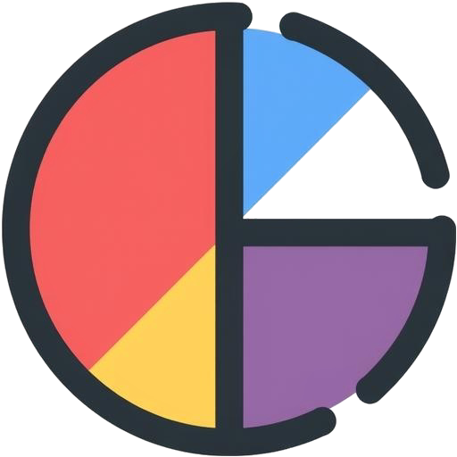
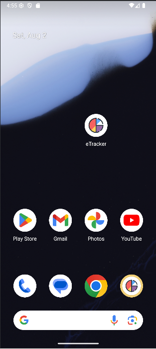
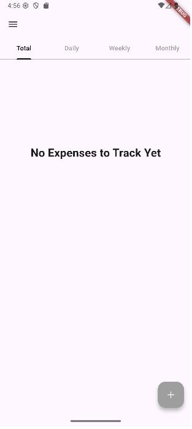
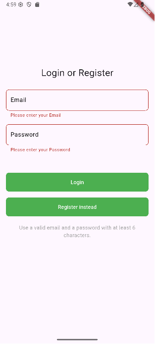
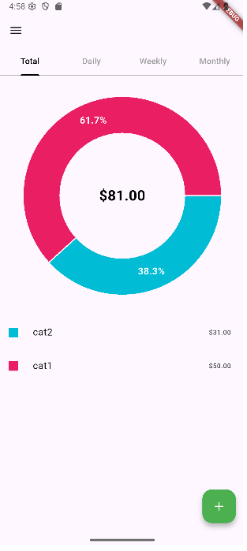
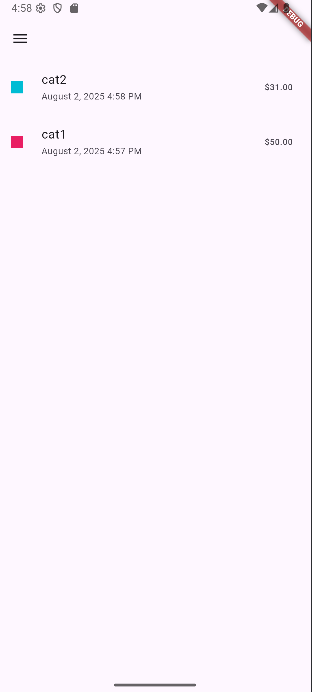
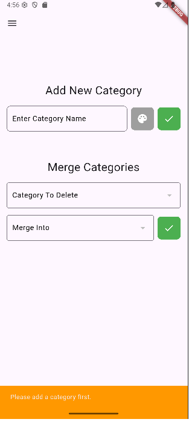
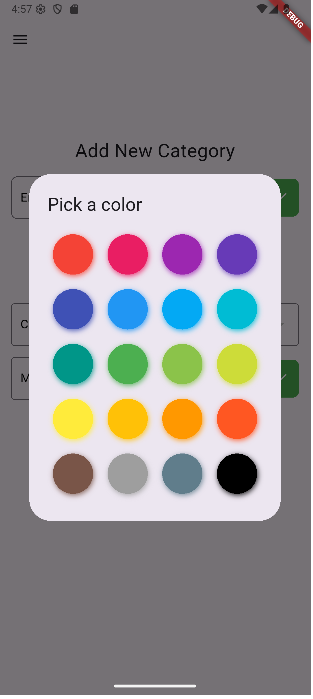
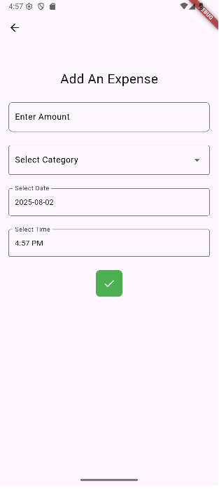
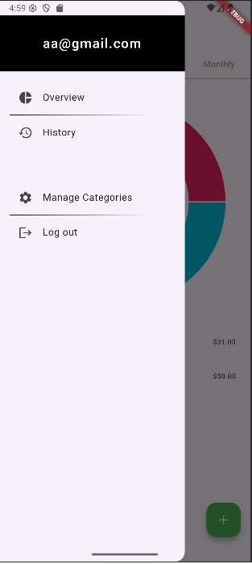

# ExpenseTracker

Flutter app for android for personal use. For tracking and managing expenses.
Code is located in the master branch.

## Features

- **User Authentication**  
  Register and log in  with email and password.

- **Intuitive Navigation**  
  Access the app through a  left-side drawer menu.

- **Overview Page**  
  - Default landing page after login.  
  - View expenses summarized by daily, weekly, monthly, or all-time periods.  
  - Visualize spending with an interactive pie chart breaking down expenses by category.

- **History Page**  
  - A list of all user's spendings

- **Adding Expenses**  
  - Enter the amount and choose category and date.
    
- **Categories Management**  
  - Create and customize expense categories with colors.  
  - Organize your expenses by moving them between categories for better tracking.

## Screenshots

### App Icon

### Overview Page without data

### Login Page

### Overview Page

### History Page

### Categories Page

### Adding Expenses

### Drawer

