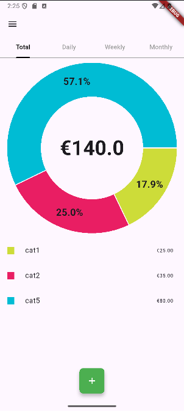
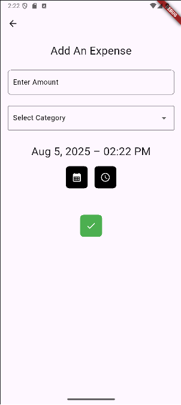

# ExpenseTracker

Flutter app for android for personal use. For tracking and managing expenses.

## Features

- **User Authentication**  
  Register and log in with email and password

- **Intuitive Navigation**  
  Access the app through a left-side drawer menu

- **Overview Page**  
  - Default landing page after login 
  - View expenses summarized by daily, weekly, monthly, or all-time periods. 
  - Visualize spending with an interactive pie chart breaking down expenses by category

- **History Page**  
  - A list of all user's spendings
  - Ability to delete on long hold

- **Adding Expenses**  
  - Enter the amount and choose category and date
    
- **Categories Management**  
  - Create and customize expense categories with colors
  - Organize your expenses by merging categories

## Screenshots

### App Icon

### App Icon on Screen

### App Icon while turning on

### Login Page

### Overview Page without data

### Overview Page

### Overview Page Landscape

### History Page without data

### History Page 

### History Page Landscape

### Add Categories Page

### Category color picker

### Add Categories Page Landscape

### Adding Expenses

### Adding Expenses Landscape

### Date Picker

### Time Picker

### Drawer

### Snack Bar success

### Snack Bar failure

### Snack Bar suggestion

### Snack Bar no internet connection

## To-Do
- Keep improving file structure and maintainability
- fix imports
- test for null values
- create home widget to add expense quickly
